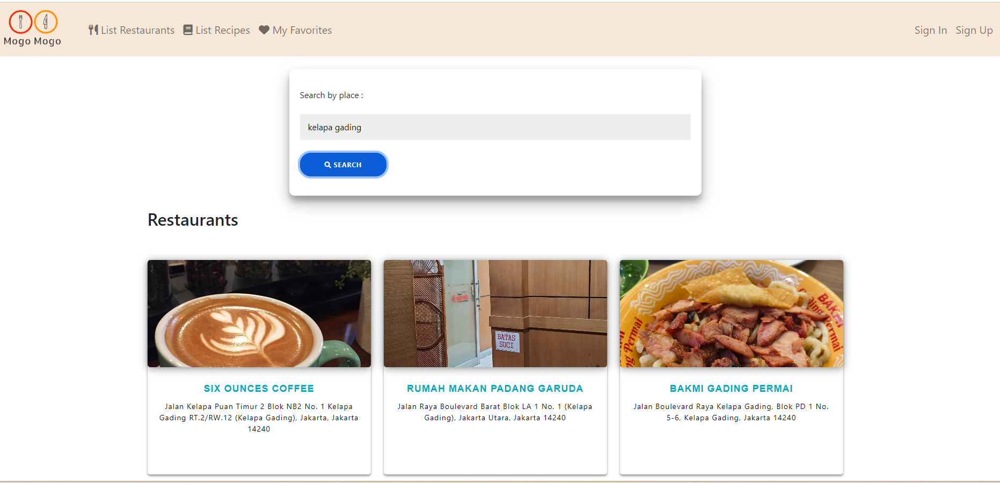
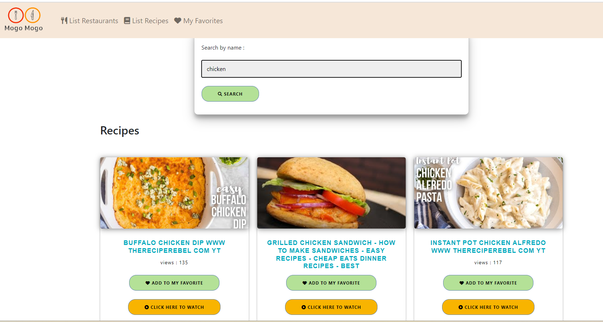
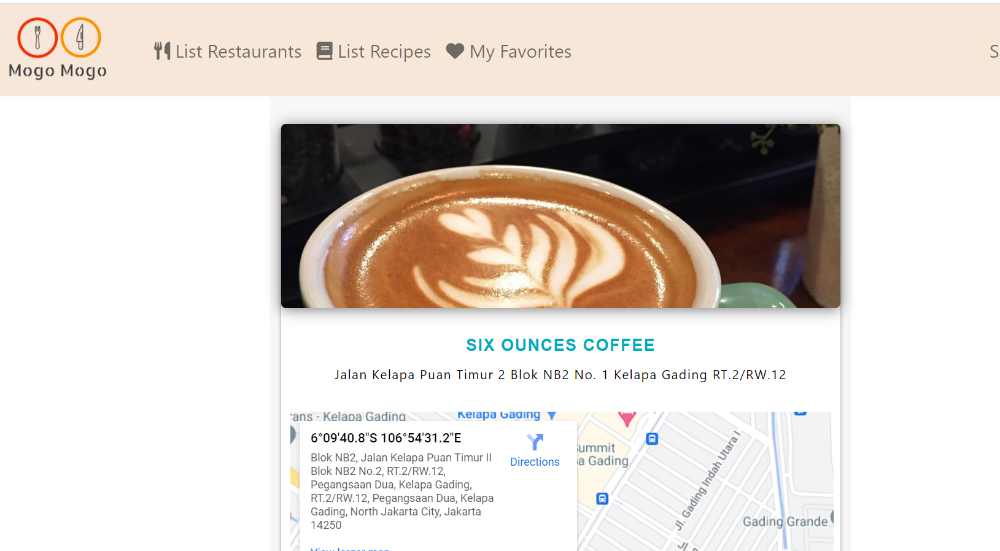

# Mogo - Mogo Client Side 
>(assignment for individual project Hacktiv8) by Debby Ria

## What's Mogo-Mogo?
Mogo - Mogo is a web-based application that provides information about a list of restaurants located around the user's desired location. In addition, Mogo - Mogo also offers recipes that users can access by searching for keywords such as chicken. Then, Mogo - Mogo will display a collection of recipes that use the chosen ingredient as a base. Users can also click on a button that directs them to cooking tutorial links on YouTube.





## Tech Stack
On the client side, I use the Javascript programming language with the `Vue 3` framework. And then I use `Vue-sweetalert` for the alert and `Pinia` for the state management.

## Project Setup

```sh
npm install
```

### Compile and Hot-Reload for Development

```sh
npm run dev
```